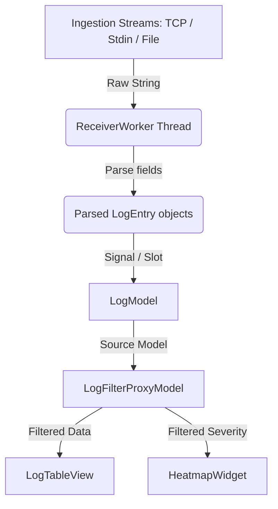

# System Architecture

Sagittarius LogViewer implements a robust, thread-safe architecture separating log ingestion, parsing, data representation, and user interface rendering.

## 1. Architectural Pattern: Model-View-Controller (MVC)

The system uses the Qt Model/View design paradigm:

### The Model Layer (`logview.ui.log_model`)
- **`LogModel`**: Keeps the list of raw and parsed log entries. Enforces memory limits by capping the maximum entries to `max_lines` (default `10000`). When exceeded, older entries are discarded to prevent memory leaks.
- **`LogFilterProxyModel`**: Sits between the view and the source model. It performs filtering and sorting lazily without altering the underlying data. It keeps index maps for bookmarks, time range filters, and search highlight matches.

### The View Layer (`logview.ui.views` & `logview.ui.components`)
- **`LogTableView`**: Optimized custom subclass of `QTableView` displaying column headers, selection, context menus, and navigation.
- **`LogDelegate`**: Custom item delegate (`QStyledItemDelegate`) that renders highlights over matches inside the table cells.
- **`HeatmapWidget`**: Renders a vertical colored visualization strip directly next to the log table, indicating where high-severity logs are located in the dataset.

---

## 2. Multi-Threaded Ingestion Model

To keep the application highly responsive, network operations and file tailing must not run on the main GUI thread.

- **`ReceiverWorker(QThread)`**: Launches a separate operating system thread.
- **Event Loop Integration**: Inside the thread's run method, it initializes an `asyncio` event loop.
- **Receivers**: Starts the chosen stream receiver (`TCPServerReceiver` or `FileTailReceiver`).
- **Parsing Workload**: The receiver reads lines, utilizes a thread executor (`run_in_executor`) to parse fields using `LogParser` (so regex CPU time does not block the event loop), and pushes the parsed `LogEntry` objects to a queue.
- **Batched Signals**: The worker transfers parsed log items back to the main thread by emitting Qt Signals in batches, minimizing GUI rendering overhead.
